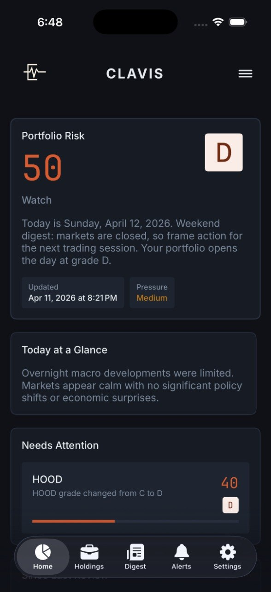

# GetClavix.com

The public product and policy website for [Clavix](https://getclavix.com), an iOS portfolio-risk briefing for self-directed investors.



## Contents

- Product overview and app screenshots
- Methodology explanation
- Privacy, terms, and refund policies
- Email confirmation and waitlist workers
- Search-engine and LLM discovery files

## Local preview

The site is static and can be served with any local HTTP server:

```bash
python3 -m http.server 8000
```

Then open `http://localhost:8000`.

## Deployment

The site is configured for Vercel through `vercel.json`. Worker scripts read credentials from deployment environment variables; no credentials belong in the repository.
